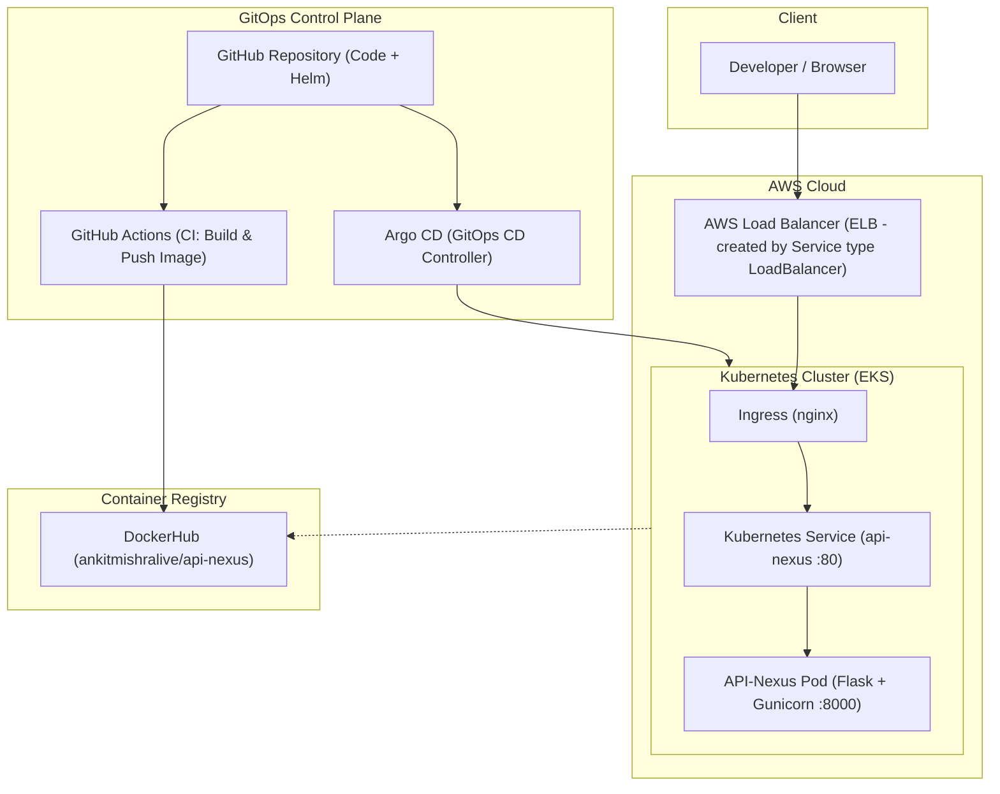

# CloudNative-ized – API-Nexus 

A **cloud-native, GitOps-driven re-architecture** of my 3 year older Flask project **API-Nexus**, modernized with Docker, Kubernetes, CI/CD, and AWS EKS.

This repository demonstrates **end-to-end DevOps + Cloud-Native practices**:

* Containerization with Docker
* CI with GitHub Actions
* Kubernetes deployment on AWS EKS
* GitOps-based CD using Argo CD
* Ingress-based traffic management

This project is intentionally built as a **learning + portfolio-grade reference** for real-world cloud-native workflows.

---

---

##  High-Level Architecture

---




When someone opens the application in a browser, the request first reaches an AWS Load Balancer that is automatically created by Kubernetes because the Service is defined as type: LoadBalancer. Since the application is running on AWS EKS,
Kubernetes handles all AWS networking for us without any manual setup. The load balancer forwards the request to the Kubernetes Service, which then sends it to the API-Nexus Pod where the Flask application runs using Gunicorn on port 8000.
The application runs inside a Docker container, and Kubernetes pulls this image from DockerHub whenever a new version is deployed. On the deployment side, all code and Helm configuration live in GitHub; GitHub Actions builds and pushes the Docker image, 
and Argo CD continuously watches the repository and automatically applies the desired state to the EKS cluster. This means the entire system can be recreated at any time using only Git.


##  Technology Stack

### Backend

* **Flask** – API server
* **Gunicorn** – Production WSGI server
* **Pandas** – Data processing
* **Requests / BeautifulSoup** – External data ingestion

### Containerization

* **Docker** (multi-stage build)
* **DockerHub** – Image registry

### CI/CD

* **GitHub Actions** – Continuous Integration
* **Argo CD** – GitOps-based Continuous Deployment

### Infrastructure

* **Kubernetes** – Container orchestration
* **AWS EKS** – Managed Kubernetes
* **AWS ELB** – Traffic entry point


##  Docker

The application is containerized using a **production-ready Dockerfile**:

Key highlights:

* Multi-stage build
* Lightweight Python base image
* Gunicorn for serving Flask
* No dev dependencies in runtime image

Docker Image:

```
ankitmishralive/api-nexus
```

---

##  CI – GitHub Actions

CI is implemented using **GitHub Actions** and runs on every push to `main`.

### CI Responsibilities

* Code checkout
* Python environment setup
* Dependency installation
* (Optional) Test & lint hooks
* Docker image build & push

### CI Flow

```
Git Push → GitHub Actions → Docker Build → DockerHub Push
```

CI configuration lives in:

```
.github/workflows/
```

---

##  CD – Argo CD (GitOps)

Deployment is handled using **Argo CD**, following **GitOps principles**.

### GitOps Model

* Git is the **single source of truth**
* Kubernetes state is continuously reconciled with Git
* No manual `kubectl apply` for application deployment

### CD Flow

```
Git Commit
   ↓
Argo CD detects change
   ↓
Helm chart rendered
   ↓
Kubernetes state reconciled
```

---

##  Kubernetes Deployment

The application is deployed to Kubernetes using:

* `Deployment` – manages pods
* `Service` – exposes the app internally or externally
* `Ingress` – optional HTTP routing via ingress-nginx

### Key Kubernetes Objects

* Deployment
* Service (LoadBalancer / ClusterIP)
* Ingress (nginx)

---

##  Ingress & Networking

For learning and simplicity:

* Application can be accessed directly via **AWS LoadBalancer DNS**
* Ingress is used for HTTP routing when needed

Note:

* Host-based routing requires DNS or `/etc/hosts`
* For learning, hostless ingress or Service LoadBalancer is preferred

---

##  AWS EKS

The Kubernetes cluster runs on **AWS EKS**:

* Managed control plane
* EC2 worker nodes
* AWS-managed networking
* Automatic LoadBalancer provisioning

Cluster lifecycle is **intentionally disposable**:

* Cluster can be deleted and recreated
* Argo CD redeploys everything from Git

---

##  Local Development

```bash
python -m venv venv
source venv/bin/activate
pip install -r requirements.txt
python app.py
```

---

## Learning Goals of This Project

This repository intentionally demonstrates:

* How to modernize a legacy Flask app
* Real CI/CD pipelines (not toy examples)
* GitOps workflows with Argo CD
* Cloud-native infrastructure thinking
* Kubernetes-first application design

---

##  Key Takeaways

* Infrastructure is **ephemeral**, Git is permanent
* Kubernetes abstracts cloud complexity
* Argo CD removes manual deployment steps
* DNS & Ingress are client-side concerns
* Cloud-native ≠ just Docker

---

##  Future Improvements

* TLS with cert-manager
* ExternalDNS + Route53
* Horizontal Pod Autoscaling
* Observability (Prometheus + Grafana)
* Security hardening (RBAC, NetworkPolicies)

---

##  Author

**Ankit Mishra**

GitHub: [@ankitgmishra](https://github.com/ankitgmishra)
Website: [https://aiankit.com](https://aiankit.com)

---

> *Thank you ! Happy Learning.*
